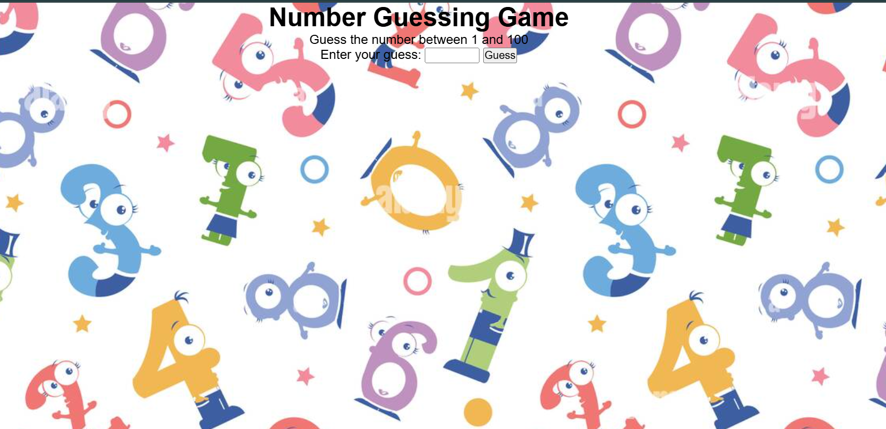

# Number Guessing Game

A simple and interactive number guessing game built with plain HTML, CSS, and JavaScript. The player has to guess a randomly generated number between 1 and 100 with helpful feedback guiding their guesses.

---

## Features

- Random number generated between 1 and 100 on page load.
- User inputs their guess via a number input.
- Feedback is given to guide the player to guess higher or lower.
- Success message when the correct number is guessed.
- Input validation to ensure guesses are within the valid range.
- Clean and responsive UI with background design.

---

## Demo

---

## Installation

No installation needed. Just clone or download the repository and open `index.html` in any modern web browser.

[git clone](https://github.com/Soumyosish/Guessing-a-number-game.git)
cd [Guessing-a-number-game]
open index.html
---

## Usage

1. Open the game in a browser.
2. Enter your guess number between 1 and 100.
3. Click "Guess" or press Enter.
4. Follow feedback to adjust your guesses.
5. After guessing correctly, you can reload the page to play again.

---

## File Structure

- `index.html` - The main HTML page.
- `style.css` - Styling for the game UI and background.
- `script.js` - Game logic and interaction.

---

## Technologies Used

- HTML5
- CSS3
- Vanilla JavaScript

---

## Contributing

Contributions, issues, and feature requests are welcome! Feel free to check the [issues page](#).

---

## License

This project is licensed under the MIT License - see the [LICENSE](LICENSE) file for details.

---

## Contact

Created by Soumyosish Pal - feel free to reach out!

---

